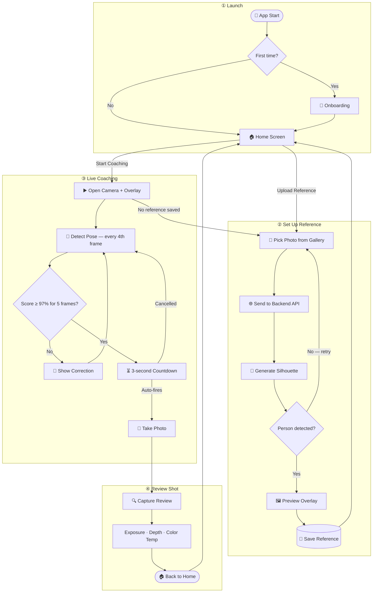

# CameraCoach 📸

<div align="center">


</div>

**CameraCoach** is a Flutter mobile app that helps you recreate a reference pose in front of the camera — without needing a professional photographer. Upload any reference photo, let the AI extract a silhouette guide, then align yourself with it in real time. When your pose matches the reference above 97%, the app automatically counts down and captures the shot.

Pose matching runs fully on-device using Google ML Kit. The optional Python backend converts your reference photo into a clean, transparent silhouette overlay.

---

## 👨‍💻 The Story Behind CameraCoach

> *"The idea came from a family trip — a perfect location, a perfect moment, and nobody who knew how to frame the shot the way I had it in my head."*

During a family trip to a scenic location, I asked my parents to take a photo. The setting was ideal, but no matter how I tried to explain the framing and pose I wanted, something was always off. The photo was fine — but it wasn't *the* photo. That frustration stuck with me, and I started thinking: this isn't just my problem. Anyone who's ever tried to direct a non-photographer knows the struggle.

That was the spark for CameraCoach.

I teamed up with a friend to build it. We split the work along our strengths — he focused on the UI and frontend, while I handled the backend logic, computer vision, and ML pipeline. We kicked off development in late February, right in the middle of our college mid-semester exam season. Still, we carved out time every evening and managed to get a rough working prototype within about six weeks.

Our first version used a stick-figure skeleton overlay drawn over the camera feed. It worked, technically, but it looked dated and got in the way of the actual frame. Around this time, we noticed high-end smartphones starting to ship AI camera modes that showed a full-body silhouette guide — a soft, glowing outline of the subject. That was the look we wanted.

So we pivoted.

Building a backend pipeline that could reliably extract a clean silhouette from *any* user-provided photo — different lighting, backgrounds, clothing, body types — took nearly two months of iteration. Getting the GrabCut segmentation, TFLite pose landmarks, and neon glow rendering to all cooperate was the hardest part of the project. We also built an auto-capture workflow into the live session: once the app detects a 97%+ pose match held for five consecutive frames, it starts a 3-second cancelable countdown and fires the shutter automatically. No fumbling with the shutter button right when you've finally nailed the pose.

---

## 🗺️ App Flow



---

## 💡 Key Features

- **Reference Photo Selection** — Import any target pose from your gallery
- **Smart Silhouette Generation** — Backend converts the reference into a transparent neon glow overlay
- **On-Device Pose Detection** — Real-time analysis using Google ML Kit (no data leaves your phone)
- **Live Match Scoring** — Continuous visual feedback on how closely your pose matches the reference
- **Auto-Capture** — Automatic 3-second countdown fires the shutter once a 97%+ match is held
- **Photo Quality Analysis** — Evaluates exposure, depth of field, dynamic range, and color balance after each shot
- **PRO Camera Controls** — Manually adjust ISO, shutter speed, white balance, and exposure compensation

---

## 🛠️ Tech Stack

| Layer | Technology |
|-------|------------|
| **Frontend** | Flutter & Dart |
| **On-Device CV** | Google ML Kit Pose Detection |
| **Backend CV** | OpenCV · NumPy · SciPy · TensorFlow Lite |
| **Backend API** | FastAPI (Python) |
| **Local Storage** | `flutter_secure_storage` · `shared_preferences` |

---

## 📂 Project Structure

```text
camera_coach/
├── android/                  # Android runner and native camera plugin
├── assets/
│   ├── images/               # App image assets
│   └── models/               # TensorFlow Lite model assets
├── backend/
│   ├── models/               # Backend TFLite model
│   ├── outline.py            # Silhouette extraction and neon overlay generation
│   ├── requirements.txt      # Python dependencies
│   └── server.py             # FastAPI upload endpoint
├── ios/                      # iOS runner and native camera plugin
├── lib/
│   ├── core/                 # App theme and constants
│   ├── features/
│   │   ├── home/             # Home screen — reference upload & coaching entry
│   │   ├── onboarding/       # First-launch walkthrough
│   │   ├── live_session/     # Live camera + pose matching + auto-capture
│   │   └── review/           # Post-capture quality analysis
│   ├── models/               # Reference data model
│   ├── services/             # Camera, pose, storage, API, and analysis services
│   ├── utils/                # Logging
│   └── widgets/              # Reusable UI components
└── test/                     # Flutter unit and widget tests
```

---

## ⚡ Getting Started

### 1️⃣ Prerequisites

- Flutter SDK 3.4 or newer
- Python 3.10 or newer
- Android Studio or Xcode for device builds

### 2️⃣ Backend Setup

```bash
cd backend
python -m venv venv
```

**Windows:**
```bash
venv\Scripts\activate
```

**macOS/Linux:**
```bash
source venv/bin/activate
```

Install dependencies and start the API:
```bash
pip install -r requirements.txt
uvicorn server:app --host 0.0.0.0 --port 8000 --reload
```

The overlay endpoint will be live at `http://localhost:8000/api/generate_overlay`

> **Note:** When testing on a physical phone, replace `localhost` with your computer's LAN IP address (e.g. `192.168.1.10`).

### 3️⃣ Flutter Setup

```bash
flutter pub get
flutter run --dart-define=BACKEND_URL=http://YOUR_PC_IP:8000
```

Or create a `.env.json` file to avoid retyping the URL:
```json
{
  "BACKEND_URL": "http://YOUR_PC_IP:8000"
}
```
```bash
flutter run --dart-define-from-file=.env.json
```

---

## 🚧 Known Limitations & What's Next

The core coaching loop works well, but one limitation stands out in the current version:

**The silhouette overlay uses a fixed scale.** It's extracted from the reference photo as-is, which means if the reference person and the live user have significantly different body proportions — for example, a taller adult trying to match a pose from a photo of a shorter teenager — the silhouette won't perfectly match the live user's shape. The alignment still works, but the visual fit isn't ideal.

**The v2 goal is dynamic overlay retargeting** — using the live user's detected keypoints to intelligently rescale and warp the silhouette to match their unique body proportions in real time. This would make the coaching experience feel truly personalized rather than just comparative.

Other items on the roadmap:
- Focus peaking in PRO mode (the plumbing is already in place)
- Self-timer (3s / 10s) selector in the camera UI
- VIDEO mode support (currently a UI placeholder)

---

## 🛡️ Security Checklist

The following files are excluded by `.gitignore` and should **never** be committed manually:

| File | Why |
|------|-----|
| `.env.json` | Contains your local backend IP |
| `android/app/google-services.json` | Firebase credentials |
| `ios/Runner/GoogleService-Info.plist` | Firebase credentials |
| `build/` | Compiled output |
| `.dart_tool/` | Generated tooling metadata |
| `android/local.properties` | Local SDK paths |

> **Prefer using Git from the terminal or GitHub Desktop** — drag-and-drop uploads to GitHub can inadvertently include files that `.gitignore` normally blocks.

---

<div align="center">

Built with ❤️ by **Abhishek Wadhwani** & **Team**

</div>
